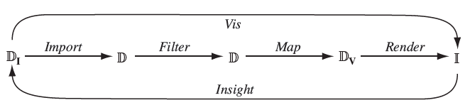

# Fediverso Data Visualization

**Este projeto, vinculado ao edital [EDITAL PROPI/IFMS N° 028/2023](https://selecao.ifms.edu.br/edital/files/iniciacao-cientifica-e-tecnologica-edital-no-028-2023-edital-no-028-2023-abertura.pdf), e que ainda em desenvolvimento, é uma implementação para um determinado conjunto de dados e não tem como objetivo fornecer dados para outros conjutos.**

Este repositório contém o código que implementa o pipeline para visualização de dados baseado na metodologia apresentada no livro [Data Visualization: Principles and Practice (2014)](https://www.amazon.com.br/Data-Visualization-Principles-Alexandru-Telea/dp/1466585269).



## Passos do Pipeline

### 1. Importação de Dados
O primeiro passo do pipeline é a importação de dados, realizado pela classe `Import`. A instância desta classe é criada da seguinte forma:

```javascript
const _import = new Import();
```

#### Entrada
O diretório de entrada para a importação é configurado usando o método `input` da instância `_import`:

```javascript
_import.input('./import/input');
```

#### Saída
O diretório de saída para a importação é configurado usando o método `output` da instância `_import`:

```javascript
_import.output('./import/output');
```

### 2. Filtragem de Dados
O segundo passo do pipeline é a filtragem de dados, realizado pela classe `Filter`. A instância desta classe é criada da seguinte forma:

```javascript
const _filter = new Filter();
```

#### Entrada
O arquivo de entrada para a filtragem é configurado usando o método `input` da instância `_filter`:

```javascript
_filter.input('./import/output/combined.json');
```

#### Remoção de Atributos
A filtragem realize as seguinte operações: 

 - remove os atributos desnecessários do arquivo de entrada:

```javascript
["countryName", ... ]
```

#### Saída
O diretório de saída para a filtragem é configurado usando o método `output` da instância `_filter`:

```javascript
_filter.output('./filter/output');
```

Este é um exemplo básico de um pipeline. Certifique-se de ajustar os caminhos e configurações de acordo com suas necessidades específicas.